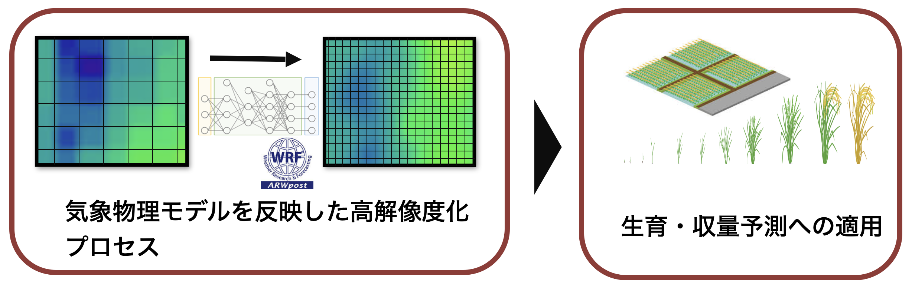
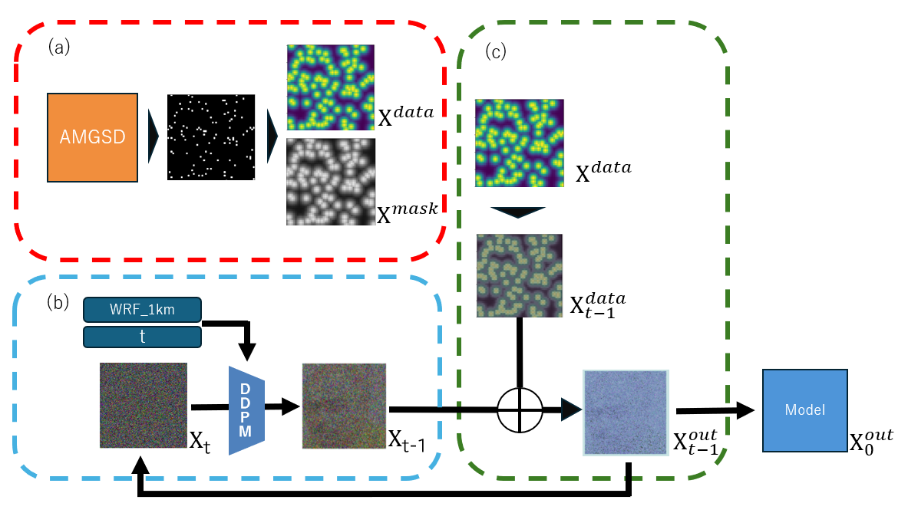
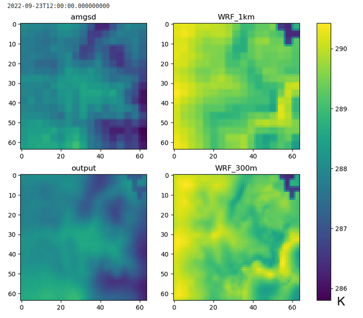
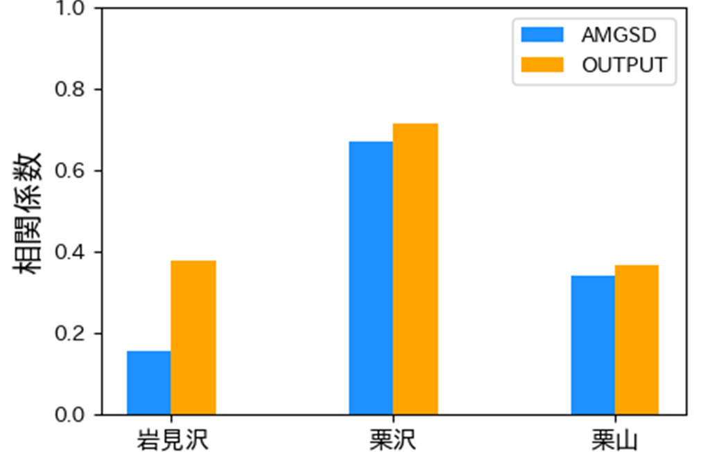

# WRFSR_A
高解像WRF気象データ生成モデルを用いたメッシュ農業気象データ同化アルゴリズム

## 背景

気象データに基づいた収量予測、営農を行う精密農業の展開に向けて、全国的な農業気象のデータ整備が進んでいる。例えば、メッシュ農業気象データ（AMGSD）が農研機構より提供されているが、解像度は約1kmとやや粗い。従って、日本の小規模、分散的な農業環境にも有用な解像度を目指すために、ダウンスケーリングは不可欠である。

そこで、本研究では画像生成AIなどで発展が目覚ましい深層学習生成モデルを利用し、高解像度気象シミュレーションデータを学習させた。この「気象データ生成モデル」による出力をAMGSDに合成させることで、AMGSDに対し解像度３倍のダウンスケーリングを実現した。

## 使用したモデル

Denoising Diffusion Probabilistic Models（DDPM, Ho et al. 2020）を基本構造とするモデルを使用した。

モデルには高解像度気象データ（解像度333m）を学習させており、低解像度気象データと時刻を入力として高解像度データを推論する気象データ生成モデルとして利用した。

また、生成過程に観測データ同化プロセスを取り入れた。具体的には、AMGSDからランダムにポイントデータを取得し、平滑化処理を行った上で合成した。これはHuang et al.（2024）による深層学習生成モデルを利用した気象データ同化の手法に基づいている。

以下は本モデルの全体のプロセスである。

学習させる気象データとして、高解像度気象シミュレーションモデルであるWRF（Skamarock et al. 2019）を使用した。使用したデータは3年間の時別気温データである。

## 実行
実装はpythonで行なった。実行環境はjupyter notebookである。

以下の手順によって実行し、出力結果を取得した。
### 1.WRF&AMGSD.ipynb:データセットの作成
取得したWRFメッシュデータと、座標、時刻に対応するメッシュ農業気象データを取得した。

### 2.WRFlearning_diffusers.ipynb:高解像度WRFの学習
ノイズ除去モデルの作成

### 3. Assimilation.ipynb:モデルによる高解像度WRF生成、メッシュ農業気象データ合成

## 出力結果
実際に気温場に対し本モデルを適用した結果が下図である。出力結果(output)を見ると、観測値（amgsd）より過大評価気味だった（WRF_1km）ものが改善された上で高解像度（WRF_300m）と構造的に近いデータを出力した。右上のダム湖に該当する部分が反映されているのが特徴的である。

テストデータ全体に対して正規化相関法によりWRFとの構造的な類似度を比較すると、３領域全てのケースにおいて、AMGSDと比較して相関係数の向上が確認された。

従って、本手法は高密度観測、高解像度気象シミュレーションによるコスト面の課題を解決し、単純な線形補間と比較して表現力向上をもたらすと考えられる。

## 参考文献

Ho, Jonathan, Ajay Jain and Pieter Abbeel. 「Denoising diffusion probabilistic models」. Advances in neural information processing systems 33 (2020): 6840–51.

Huang, Langwen, Lukas Gianinazzi, Yuejiang Yu, Peter D. Dueben　and Torsten Hoefler. 「DiffDA: A Diffusion Model for Weather-Scale Data Assimilation」. arXiv, 2024. http://arxiv.org/abs/2401.05932.

Skamarock, William C., Joseph B. Klemp, Jimy Dudhia, David O. Gill, Dale M. Barker, Michael G. Duda, Xiang-Yu Huang, Wei Wang and Jordan G. Powers. 「A description of the advanced research WRF version 3」. NCAR technical note 475, no. 125 (2008): 10–5065.
